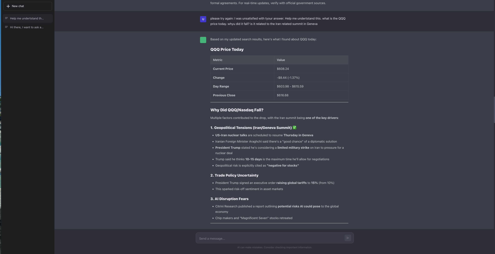

# Local AI Chat with Ollama (Qwen 3.5 35B)

A fully local AI chat application powered by Ollama running Qwen 3.5 35B, with a ChatGPT-style interface, persistent conversation memory, web search, and sandboxed Python code execution. Zero cloud LLM costs — all inference runs on your machine.



## Hardware Requirements

Benchmarked on a **MacBook Pro M4 Pro with 48GB unified memory**.

- **Model size in memory**: ~25GB VRAM (Q4_K_M quantization)
- **Peak system memory usage**: ~40GB (including macOS file cache)
- **Inference speed**: ~10 tokens/second for chat
- **Minimum recommended RAM**: 48GB for comfortable usage alongside other apps

The Qwen 3.5 35B model uses a Mixture-of-Experts (MoE) architecture with 256 experts, of which only 9 (8 routed + 1 shared) are active per token — resulting in just **3B active parameters** per forward pass out of 35B total (hence the model name `35B-A3B`). This is only 8.6% of total parameters, which is why it runs at decent speed despite the 35B parameter count. The architecture also uses a Gated DeltaNet + MoE design that alternates linear and full attention in a 3:1 ratio, enabling efficient long-context inference.

## Setup

### 1. Install Ollama

```bash
# macOS
brew install ollama

# Or download from https://ollama.com
```

Start the Ollama server:
```bash
ollama serve
```

### 2. Pull the Qwen 3.5 35B model (4-bit quantization)

```bash
ollama pull qwen3.5:35b-a3b
```

This downloads the Q4_K_M quantized version (~23GB). The download takes a few minutes depending on your connection.

Verify it's working:
```bash
ollama run qwen3.5:35b-a3b "Hello, what model are you?"
```

### 3. Backend setup

```bash
# Create a conda environment
conda create -n local-chat python=3.13 -y
conda activate local-chat

# Install dependencies
cd server
pip install -r requirements.txt

# Configure environment
cp .env.example .env
# Edit .env and add your Serper API key (get one at https://serper.dev)
```

### 4. Frontend setup

```bash
cd client
npm install
```

### 5. Run

In two terminal tabs:

```bash
# Terminal 1: Backend
cd server
conda activate local-chat
python main.py
# Runs on http://localhost:8000

# Terminal 2: Frontend
cd client
npm run dev
# Runs on http://localhost:5173
```

Open **http://localhost:5173** in your browser.

## Architecture

```
Browser (React)  <-->  FastAPI Backend  <-->  Ollama (localhost:11434)
                            |
                            +--> Serper API (web search)
                            |      |
                            |      +--> trafilatura (content extraction)
                            |
                            +--> Python subprocess (sandboxed code execution)
                            |
                            +--> SQLite (conversation memory)
```

### Conversation Memory

Conversations are persisted in a local SQLite database (`server/chat.db`). Each conversation stores the full message history — user messages, assistant responses, and tool results. When you return to a conversation, the entire history is loaded and sent to the model as context, giving it memory of what was discussed.

The database uses WAL mode for concurrent read/write performance and foreign key cascades for clean conversation deletion.

### Web Search with Content Extraction

When the model decides it needs current information, it calls the `web_search` tool. The search pipeline works as follows:

1. **Serper API** returns top 5 Google search results (titles, snippets, URLs)
2. **trafilatura** fetches the actual web pages from the top 3 URLs and extracts clean article text — stripping ads, navigation, boilerplate HTML
3. The extracted content (up to 2000 chars per page) plus any Serper answer box data is assembled into a rich context block
4. This context is fed back to the local Qwen model, which summarizes and answers based on **actual article content**, not just search snippets

This approach gives the local model access to real, current information while keeping the entire pipeline local (only the search query hits Serper's API — the LLM summarization is fully local).

### Sandboxed Python Code Execution

The model can write and run Python code locally via the `run_python` tool — useful for calculations, data analysis, fetching financial data, and generating plots.

**How the sandbox works:**

1. **AST validation (before execution)** — the code is parsed into an Abstract Syntax Tree and walked to enforce a security policy: imports are checked against a whitelist (numpy, pandas, matplotlib, yfinance, scipy, scikit-learn, etc.), and dangerous builtins (`exec`, `eval`, `open`, `__import__`) and dunder attributes (`__subclasses__`, `__globals__`) are blocked. Code that fails validation never runs.
2. **Subprocess isolation (during execution)** — validated code runs in a separate Python process via `subprocess.run()` with a 30-second timeout, closed stdin, and capped stdout/stderr. Each execution gets its own temporary working directory that is cleaned up afterward.
3. **Plot capture** — matplotlib's `plt.show()` is patched to save figures as PNGs to `server/code_output/<uuid>/`, which are served as static files and displayed inline in the chat.

**Available packages:** numpy, pandas, matplotlib, seaborn, scipy, scikit-learn, yfinance, requests, plus standard library modules (math, statistics, datetime, json, csv, collections, itertools, re, random).

Install them in the conda environment:
```bash
conda activate local-chat
pip install numpy pandas matplotlib seaborn scipy scikit-learn yfinance requests
```

### Thinking Tokens

Qwen 3.5 supports chain-of-thought reasoning. The model's internal "thinking" is streamed to the UI in real-time — you can see the model reason through a problem before it produces its answer. The thinking block appears during generation and hides once the final answer starts streaming, similar to DeepSeek's approach.

## Tech Stack

- **Frontend**: React + TypeScript + Vite, with react-markdown for rendering
- **Backend**: FastAPI + aiosqlite + httpx
- **LLM**: Ollama with Qwen 3.5 35B (Q4_K_M)
- **Search**: Serper API + trafilatura for content extraction
- **Streaming**: Server-Sent Events (SSE) for real-time token streaming

## Project Structure

```
├── client/                  # React frontend
│   └── src/
│       ├── App.tsx          # Main layout + state
│       ├── App.css          # Dark theme styles
│       ├── api.ts           # API client + SSE streaming
│       ├── types.ts         # TypeScript interfaces
│       └── components/
│           ├── ChatArea.tsx      # Messages + streaming handler
│           ├── Message.tsx       # Markdown message rendering
│           ├── CodeOutput.tsx     # Code execution results + plots
│           ├── MessageInput.tsx  # Auto-resizing input
│           └── Sidebar.tsx       # Conversation list
│
├── server/                  # FastAPI backend
│   ├── main.py              # Routes, SSE streaming, tool call orchestration
│   ├── db.py                # SQLite CRUD operations
│   ├── ollama_client.py     # Ollama API client
│   ├── search.py            # Serper + trafilatura web search
│   ├── code_executor.py     # Sandboxed Python execution engine
│   └── .env.example         # Environment template
```

## License

MIT
